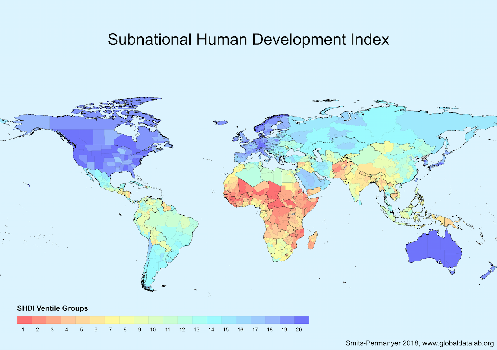

---
---

 
### Interesting Maps and Territories
Dec 18 2018 last updated  

  
<a href="http://fakeisthenewreal.org/reform/">
 
<small>Electoral college reform (fifty states with equal population, 2012) 
</small></a>
<small>
美国每州政改变成大概6亿人口的州，得名于重要地理特点。 
</small>

  
<a href="https://en.wikipedia.org/wiki/Fra_Mauro_map">
 
<small>Fra Mauro map (~1450) North-South (inverted) rotation 
</small></a>
<small>
Creation of the Italian monk and cartographer, depicting Europe most accurately and stretching as far as Japan. 
</small>

  
<a href="http://hdr.undp.org/en/content/subnational-human-development-index-moving-beyond-country-level-averages">
 
<small>Human Development Index at a municipal level, 2015 data. 
</small></a>
<small>
HDI is a composite that proxies health, knowledge, and living standard
via life expectancy, education years, and purchasing power parity. 
</small>

     
<small> back to [index](../../)</small>

─────────────────────────────── 
