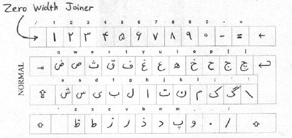

---
---

 
### What I Wish I Knew When I Was Learning Farsi
Mth DD YYYY updated 

 
Resources:
* English-Farsi dictionary app
  * TODO
* Farsi-Farsi dictionary app
  * TODO
* Browser pop-up dictionary
  * TODO
* Input tools
  * Mobile - gboard / swiftkey
  * Linux PC - fcitx
* Lessons
  * [Easy Persian](http://www.easypersian.com/)

 
Table of Contents
*
{:toc}

  
## Some technical puzzles
 

I think I have configured arch/fcitx/vim for typing farsi script right to left. 
The final few steps are as follows.

- First, :set rl
- Then, switch to farsi input (I use ^\\)
> type your text
- Next, switch back to english input (^\[)  (... ^] is for pinyin)
- Now, :set norl
- Finally save as normal (not with :%!rev)

Use a div to right-align.
If you are writing a farsi only document, may also run vim -F [...]

ش ذ ز ی ث ۱ ۲ ۳ ۴ ۵

  
## Perso-Arabic alphabet
 

 

<small> Perso-Arabic keyboard layout, which hopefully matches fcitx configured irisi m17n? </small>

  
Each of 32 characers may have final, medial, initial and isolated forms. (Most have less.)

the "zero-width joiner" ZWJ can change a character to its various forms with key \`, for example: 
ب ب‍ ‍ب‍ ‍ب

Similarly, there is the "zero-width non-joiner" ZWNJ typed by shift-b: 
ب‌ب

There are three short and three long vowels. These are not letters per se but are marked
on or under letters to give readability.

Short vowels:
  * ُ  | /o/ as in /pork/ | key T
  * َ  | /a/ as in /pad/  | key U
  * ِ  | /e/ as in /pet/  | key Y

Marking letters
  * ْب ٌب ٍب ًب ُب ِب َب ّب
  * Q W E R T Y U I

Long vowels:
  * آ │ ā │ 'Alef' │ key H
  * ی │ ī │ 'Yeh'  │ key d 
  * و │ ū │ 'Waw'  │ key , 

So the letter beh ب with all 6 vowel sounds

بَ بِ بُ با بی بو

(from right) 'ba(t)' 'bay' 'bo' 'baw' 'bee' 'boo'

The short a and e are like little gasps, which are to my ears somewhat inconsistent if represented in English.
The other four are more straightforward, short 'o' rhymes with 'toe', long 'āw' 'ēe' 'ōo'.
* -ahh
* -aeyh
* toe
* aww shucks
* pee
* poo

Vowels:

| :-:      | :-: |
|  long a  | آ   |
|  long i  | ای  |
|  long u  | او  |

Alphabet:

| Name transl.   | final-medial          | initial-isolate   | key | # |
| :-:            | :-:                   | :-:               | :-: |   |
|      alef      | ‍ا‍ ‍  | ا آ‍         | h   | 1 |
|      beh       | ‍ب‍ ‍ب | ب ب‍         | f   | 2 |
|      ye        | ‍ی‍ ‍ی | ی ی‍         | d   | 3 |
|      pe        | ‍پ‍ ‍پ | پ پ‍         | m   | 4 |
|      se        | ‍ث‍ ‍ث | ث ث‍         | e   | 5 |
|      te        | ‍ت‍ ‍ت | ت ت‍         | j   | 6 |
|      nun       | ‍ن‍ ‍ن | ن ن‍         | k   | 7 |
|      dal       | ‍د‍ ‍  | د  ‍         | n   | 8 |
|      re        | ‍ر‍ ‍  | ر  ‍         | v   | 9 |
|      ze        | ‍ز‍ ‍  | ز  ‍         | c   | 10|
|      že        | ‍ژ‍ ‍  | ژ  ‍         | C   | 11|
|      lām       | ‍ل‍ ‍ل | ل ل‍         | g   | 12|
|      mim       | ‍م‍ ‍م | م م‍         | l   | 13|
|      he havvaz | ‍ه‍ ‍ه | ه ه‍         | i   | 14|
|      khe       | ‍خ‍ ‍خ | خ خ‍         | o   | 15|
|      he hotti  | ‍ح‍ ‍ح | ح ح‍         | p   | 16|
|      jim       | ‍ج‍ ‍ج | ج ج‍         | [   | 17|
|      che       | ‍چ‍ ‍چ | چ چ‍         | ]   | 18|
|      sin       | ‍س‍ ‍س | س س‍         | s   | 19|
|      shin      | ‍ش‍ ‍ش | ش ش‍         | a   | 20|
|      kāf       | ‍ک‍ ‍ک | ک ک‍         | ;   | 21|
|      gāf       | ‍گ‍ ‍گ | گ گ‍         | '   | 21|
|      vāv       | ‍و‍ ‍  | و  ‍         | ,   | 22|
|      fe        | ‍ف‍ ‍ف | ف ف‍         | t   | 23|
|      qāf       | ‍ق‍ ‍ق | ق ق‍         | r   | 24|

  
## Grammar
 

Personal pronouns:  

|           |  translit.    |                    |
|   ------: | :-----------: | :----------------: |
| من        |   /man/       | I                  |
| تو        |   /tav/       | you                |
| ما        |   /mā/        | we                 |
| شما       |   /shomā/     | you (honor, plural)|
| او        |   /oo/        | s/he               |
| انها      |   /ānhā/      | they               |

Subject-verb ending:

|           |  translit.    |                    |
|   ------: | :-----------: | :----------------: |
| دارم      |   /dāram/     | I have             |
| داری      |   /dāri/      | you have           |
| داریم     |   /dārim/     | we have            |
| دارید     |   /dārid/     | you (plural) have  |
| دارد      |   /dārad/     | it,s/he has        |
| دارند     |   /dārand/    | they have          |
| هستم      |   /hastam/    | I am               |
| هستی      |   /hasti/     | you are            |
| هستیم     |   /hastim/    | we are             |
| هستید     |   /hastid/    | you (plural) are   |
| آست       |   /ast/       | it,s/he is         |
| هستند     |   /hastand/   | they are           |

Present progressive prefix:

میگویم

"I am saying"

Plural noun suffix:

|           |  translit.    |                    |
|   ------: | :-----------: | :----------------: |
| ها        |   /hā/        | plural suffix      |
| ان        |   /ān/        | plural suffix      |

-ha can be used for almost all, but for some nouns, -an may not be.

  
## Corpus
 

مادر سادا دا دوست داری

     
back to [index](../../)</small>

─────────────────────────────── 
